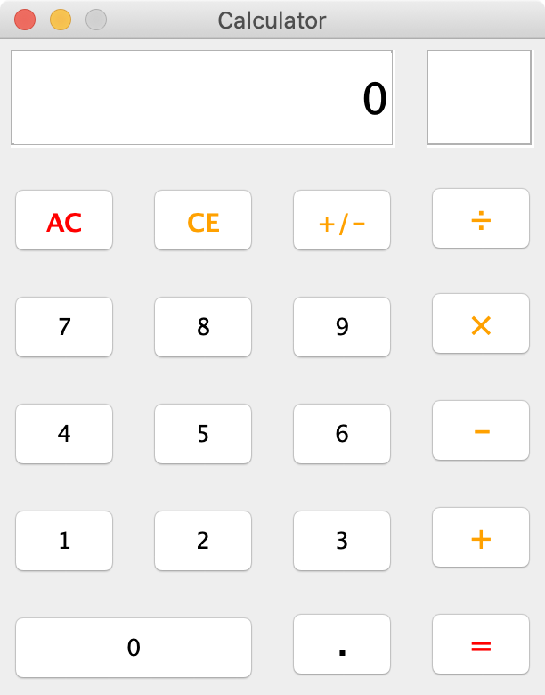

# Java Swing MVC Calculator

**Lab Assignment no. 2 for Interactive Systems course.**

A simple GUI based calculator made with Java Swing following the MVC pattern.

It works like a typical calculator in the sense that you can concatenate operations (without pressing the equal button in every step).

Functionality and layout was inspired by the iPhone iOS 13 Calculator App.

## Documentation

Documentation (javadoc) can be found [here](https://andressalinas97.github.io/Java-Swing-MVC-Calculator/javadoc/).

## Getting started

This project was created using NetBeans IDE 8. You can import the project and start working on it or simply compile and run like in any other java project (the main class is `calculator.Calculator`).
